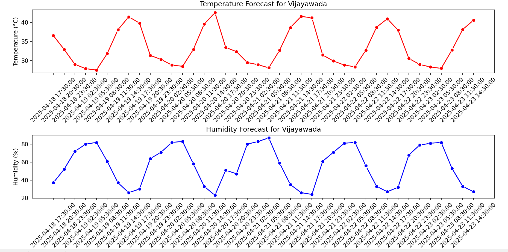
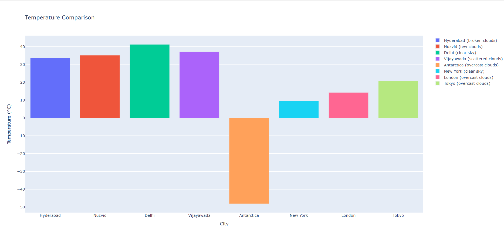
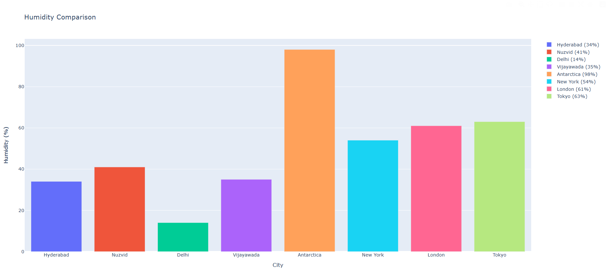

# 🌦️ Real-Time Weather Dashboard

This Weather Dashboard is a Python-based application that fetches **real-time weather data** from the OpenWeatherMap API, visualizes it using graphs and interactive maps, and allows users to monitor **temperature**, **humidity**, and more for multiple cities.

---

## 🚀 Features

- 🌍 Real-time weather updates every 2 minutes
- 📊 Dynamic graphs for temperature and humidity comparison across cities
- 🌞 Computation of advanced metrics like UV Index, Wind Chill, and Sunlight Duration
- 🗺️ Interactive weather map with Folium
- 📉 Visualizations using Plotly and Seaborn
- 🧩 Error handling for API failures

---

## 🛠️ Libraries Used

- `requests`
- `json`
- `datetime`
- `matplotlib`
- `seaborn`
- `plotly`
- `folium`
- `pandas`
- `time`

---

## 📷 Screenshots

### 1. 📌 **Temperature & Humidity of Selected City**



> This graph displays the **current temperature and humidity** values of the selected city, updating every 2 minutes. It helps track immediate atmospheric changes and micro-climate effects.

---

### 2. 🌡️ **Temperature Comparison Across Cities**



> This line graph visualizes the **temperature variations across all selected cities**. It offers a quick comparison of which city is hotter or colder at a given time, useful for travelers and researchers.

---

### 3. 💧 **Humidity Comparison Across Cities**



> This chart compares the **humidity levels in all monitored cities**, providing insight into the moisture content of each location's atmosphere.

---

## 🖥️ How to Run

1. Clone the repository:
   ```bash
   git clone https://github.com/Navyasree-ulava/Weather-Dashboard.git
   
2. Install the required libraries:
   ```bash
   pip install requests schedule folium plotly matplotlib seaborn

3. Run the main script:
   ```bash
   python weather_dashboard.py
